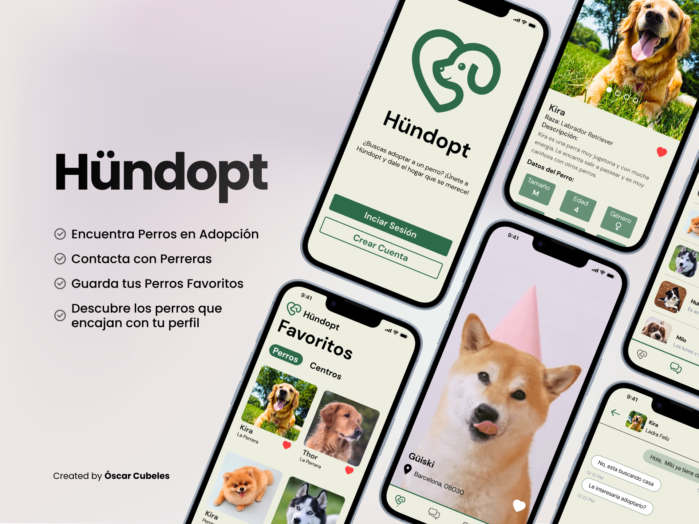

# Hündopt

The project is a mobile application developed with Flutter using the state management with GetX. 
The app is designed to help solve the problem of animal and especially dog abandonment in Spain by putting dog shelters and potential dog adopters in contact.

## App Features

Inside Hündopt, users can do the following actions: 

1. **Register**: Create an account using username, email and password.
2. **Log In**: to the app using your account credentials.
3. **Change Password**: Reset the password in case of forgotten password.
4. **Explore**: Explore and find potential dogs to adopt.
5. **Find Dog Data**: See detailed information of each individual dog such as multiple pictures, name, age, description, health status, location, friendliness, shelter, etc.
6. **Like Dogs**: Mark a dog as liked.
7. **Like Shelters**: Mark a shelter as liked.
8. **Reserve Dogs**: Mark a dog as reserved to start the adoption process.
9. **Chats**: Chat with the shelter of the dog to set up a visit to the dog shelter.
10. **See Shelter Dogs**: Find all dogs in a concrete Shelter.
11. **See Shelter Info**: See contact information of a shelter such as phone number, email, and social media.
12. **Adopt Guide**: See a guide of the steps to follow in order to adopt a dog in Spain.
13. **Personality Form**: Fill a personality form to know which type of dog is its best match.
14. **Edit Profile**: Edit its account details such as username, picture, email, or phone number.
15. **Log Out**: Close current session.
16. **Delete Account**: Delete the account and all user data associated with it.

## Technologies Used

1. **Figma**: Figma is a web-based UI and UX design tool that allows designers to create, collaborate, and share designs in real-time. It was used for this project's UI and UX design. To view the Figma design for this project, click [here](https://www.figma.com/file/sQgwVRsUWw7UCdb3qMSVrd/H%C3%BCndopt-Desing?type=design&node-id=362%3A2048&mode=design&t=riBSyJIMElXCTdeh-1).
2. **Flutter**: Flutter is a mobile app development framework that allows developers to build high-performance, high-fidelity, apps for iOS and Android, using a single codebase. Flutter was chosen for this project because it allows programming an app once, and the code is generated for both iOS and Android.
3. **GetX**: GetX is a state management package for Flutter that combines high-performance state management, intelligent dependency injection, and route management. It is an extra-light and powerful solution for Flutter that makes it easy to build high-performance applications with the Flutter SDK.
4. **Firebase Firestore**: Firebase Firestore is a cloud-based NoSQL document database that is used to store and sync data for mobile and web applications. It was used for this project's backend development to ease user management and data storage without the need to create a personalized database.

## How to make the code work

To make the code work, firstly you must have Flutter installed in your machine. To install Flutter, follow the instructions from the official website [here](https://flutter.dev/docs/get-started/install).

Then, follow these steps:

1. Clone the repository to your local machine.
2. Open the project in your preferred IDE or code editor.
3. Run `flutter pub get` to install all the dependencies.
4. Run the app using `flutter run`.
